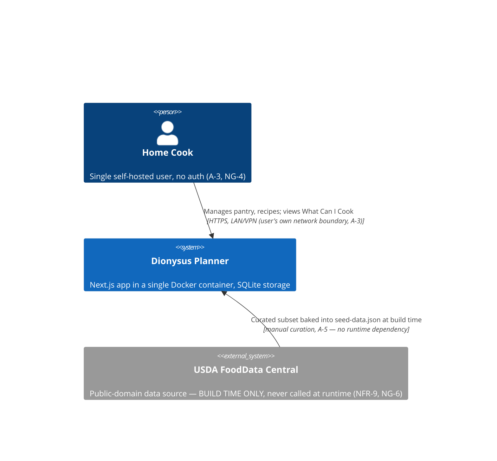
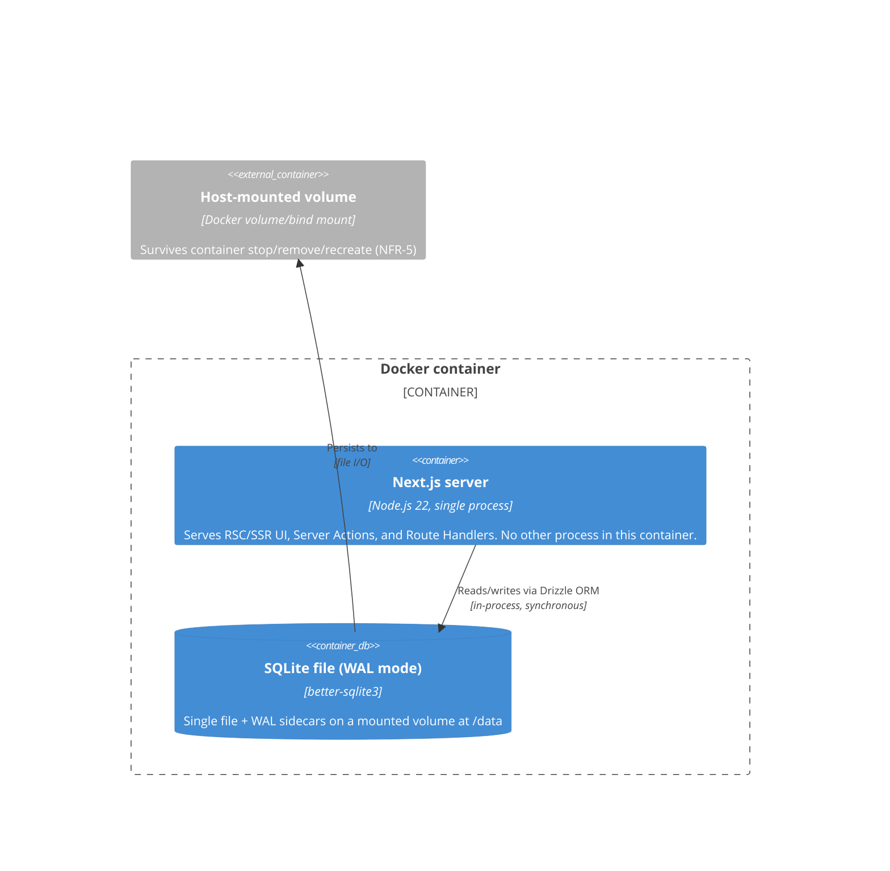

# Dionysus Planner — v1 Architecture Document

**Status:** APPROVED v3 (2026-07-11) — validator re-review passed; human gate passed. Pantry increment rule (reject cross-class increment without density, offer replace) confirmed by the human.
**Date:** 2026-07-11
**Traces to:** PRD v2 (APPROVED, 2026-07-11), locked constraints in PRD §10 A-6 and human decisions: Next.js, SQLite, Docker single-container, single-user no-auth, offline at runtime (seed bundled), FR-12 (density conversion) IN v1 scope, servings-count-only (no serving-weight).

This document is the sole source of technical decisions for v1. Where the PRD left a choice open, this document closes it. Implementers and the story-planner should not need to re-decide anything below; deviations require a new ADR, not a silent substitution.

---

## 1. Driving Architecture Characteristics

Derived from the PRD's NFRs and locked constraints, ranked by how strongly they constrain the design:

| Characteristic | Why it dominates | Traces to |
|---|---|---|
| **Simplicity / operability** | Single self-hosted user, no ops team, no SRE on call; the architecture must be runnable by "docker run" and understandable by one person. This outranks scalability, extensibility-for-its-own-sake, and fashionable distributed patterns. | A-3, NG-4, A-6, NFR-1 |
| **Offline self-containment** | The app must work with zero outbound network access at runtime; all data (seed catalog) must be baked into the build artifact. Rules out any live API integration, CDN-fetched assets, or lazy remote seed downloads. | NFR-9, NG-6 |
| **Data durability & idempotent lifecycle** | A single SQLite file on a mounted volume is the entire system of record; container recreation/upgrade must never lose or duplicate data, and re-seeding must be idempotent and override-preserving. | NFR-5, FR-28, FR-3/FR-4 |
| **Computation correctness over speed** | Nutrition math and matching/ranking must be *exactly right* (0.5% tolerance, no silent zeros, ID-only matching) before they need to be fast — though at this data scale both are achievable simultaneously. | FR-17, FR-19, FR-20, FR-21, FR-24, NFR-7 |
| **Modest, bounded scale performance** | 2,000 ingredients / 500 recipes / 300 pantry items is small enough that "will it scale" is not a real risk — the risk is only "did we accidentally write an O(n²) query," addressed explicitly in §6. | NFR-2, NFR-3 |
| **Responsive on a phone in the kitchen** | Usable at 375px viewport as well as desktop — an architectural constraint on component/layout choices, not just a CSS afterthought. | NFR-8 |

Explicitly **de-prioritized** (informs "what not to build"): multi-tenancy, horizontal scaling, high write concurrency, authentication/authorization, i18n, live external integrations, and premature caching layers — none of these are asked for and building them would violate the simplicity characteristic.

---

## 2. Architecture Style & Rationale

**Style: Modular monolith, single Next.js application, single Docker container, single SQLite file.**

- **One deployable unit.** Next.js's App Router serves both the UI (RSC/SSR) and the backend surface (Server Actions + a small number of Route Handlers) from one Node process. There is no separate API service, no message broker, no cache tier.
- **Strict internal module boundaries** (domain / data / UI — see §5) give the *benefits* usually cited for microservices (testability in isolation, clear ownership, replaceable layers) without the *costs* (network calls between "services," distributed transactions, deployment orchestration) that this project has no need to pay for.

**Why not alternatives:**

| Alternative | Why rejected |
|---|---|
| **Microservices / separate API + SPA** | No independent scaling, team, or deployment-cadence need exists (single user, single container per A-6). Would add network hops, serialization, and multi-process failure modes for zero benefit. |
| **SPA (client-rendered) + separate backend API** | Fails NFR-2 (2s LCP) more easily than server rendering for read-heavy list views at NFR-3 scale, and duplicates validation/type logic across a client and server boundary that doesn't need to exist here (both live in the same repo/runtime anyway). |
| **Serverless functions (e.g., Vercel Functions) per route** | Incompatible with the single-container, offline, file-based-SQLite deployment model (A-6, NFR-9); serverless cold starts and ephemeral filesystems don't cohabit with a mounted SQLite volume. |
| **CQRS / event sourcing** | Massive over-engineering for a single-writer, single-user CRUD app with no audit/replay requirement. Rejected outright — noted only because the agent's own remit mentions it as an available advanced pattern; it does not apply here. |
| **Postgres/MySQL instead of SQLite** | A-6 locks SQLite. Even absent that lock, a client-server DB would add an extra container/process, which the "single-container" constraint and simplicity characteristic both argue against. |

The one deliberate internal split — **domain logic kept framework-free** — exists specifically to keep unit conversion, nutrition computation, and matching testable without spinning up Next.js or a database, per the TDD workflow this pipeline uses.

---

## 3. Tech Stack Decisions (mini-ADRs)

Each decision is final for v1. "Consequences" includes what we accept giving up.

**ADR index** (numbered by creation order, not document position): ADR-001 Next.js 15 App Router (§3) · ADR-002 RSC-first (§3) · ADR-003 Drizzle + better-sqlite3 (§3) · ADR-004 Server Actions + Route Handlers (§3) · ADR-005 Zod shared validation (§3) · ADR-006 Tailwind + shadcn/ui (§3) · ADR-007 Vitest + Playwright (§3) · ADR-008 pnpm (§3) · ADR-009 Node 22 LTS (§3) · ADR-010 Debian-slim base image (§7) · ADR-011 no caching/precomputation (§6).

### ADR-001: Next.js 15, App Router (not Pages Router)
- **Context:** A-6 locks Next.js; must choose router paradigm and version line.
- **Decision:** Next.js 15.x, App Router exclusively (no `pages/` directory). Pin the exact patch to the latest 15.x release at implementation start.
- **Consequences:** Gains React Server Components, streaming, layouts, and Server Actions natively — all used below. Accepts App Router's steeper mental model (server/client component split) over Pages Router's simplicity, because RSC is what makes read-heavy views (Pantry, Recipe list, What Can I Cook) fast without a separate API round-trip (§4 ADR-002).

### ADR-002: RSC-first, client components only where interactive
- **Context:** Must decide the client/server component split.
- **Decision:** Default to **Server Components** for anything that only reads and displays data: Pantry list, Recipe list, Recipe detail (nutrition display), Ingredient catalog, What Can I Cook (initial render). **Client Components** only for: forms with local state (pantry item add/edit, recipe editor, ingredient create/override), the ingredient search-as-you-type box, sort/filter/tag controls, and the near-match threshold slider (FR-23).
- **Consequences:** Minimizes client JS shipped for the views the PRD cares most about (NFR-2). Client islands call back into the server via Server Actions or the Route Handlers in ADR-004 — they never carry business logic (validation is still re-run server-side, per §4 ADR-005 and the secure-coding note in §6).

### ADR-003: Drizzle ORM + `better-sqlite3` driver (not Prisma)
- **Context:** Need an ORM/query layer for SQLite that (a) has excellent SQLite support, (b) has a clean migration story, (c) works cleanly inside a Next.js `standalone` Docker build, and (d) doesn't bloat the image.
- **Decision:** **Drizzle ORM** with the **`better-sqlite3`** driver (synchronous, in-process, no external query-engine binary). Migrations authored/generated via `drizzle-kit`.
- **Consequences:**
  - *Accepted:* one native addon (`better-sqlite3`) to manage across build/runtime OS — mitigated in §7/§9 by using a matching base image across build and run stages.
  - *Rejected — Prisma:* Prisma's SQLite support is solid but ships a separate query-engine binary (per-platform, several MB) that has historically been finicky with Next.js's file-tracing for `output: 'standalone'` and adds meaningfully to image size — a worse fit for NFR-4 and for offline/no-postinstall-download builds (Prisma's engine fetch step needs to be pinned/vendored, adding build complexity for no benefit here).
  - *Rejected — raw `better-sqlite3` with hand-written SQL, no ORM:* would leave migrations and type-safety to be reinvented by hand; Drizzle's schema-as-TypeScript gives compile-time-checked queries and a real migration tool for near-zero extra weight.
  - Drizzle's SQL-shaped query builder maps directly onto the single-query scan needed for §6's matching flow — no ORM-induced N+1 risk if used as intended (one join query, not per-row lazy loads).
  - **Bundler config (mandatory):** `next.config.ts` MUST declare `serverExternalPackages: ['better-sqlite3']` so the Next.js bundler treats the native addon as external instead of attempting to bundle it — this is the primary, standard fix in Next.js 15 for native modules in RSC/Server Action code paths; `outputFileTracingIncludes` (§9 Risk #2) is the secondary remedy if standalone tracing still misses the `.node` binary.
  - **Runtime migrations:** migrations are applied at boot via **`drizzle-orm`'s programmatic migrator**, wrapped in `data/migrate.ts` (`runMigrations(db)`, which holds the `drizzle-orm/better-sqlite3/migrator` import so the §5 boundary rule — only `/data/**` imports drizzle — stays intact). The migrator is a runtime dependency bundled into standalone output. `drizzle-kit` remains a dev-only tool for *generating* migrations; it is never present nor needed in the runtime image. See §6 Flow A.

### ADR-004: Server Actions (mutations) + Route Handlers (parameterized reads) — no tRPC, no GraphQL
- **Context:** Need a way to move data across the client/server boundary for both form submissions and client-driven reads (search-as-you-type, threshold slider, sort/filter).
- **Decision:**
  - **Server Actions** (`"use server"`, colocated in `/app/actions/*`) for all mutations: create/edit/delete Ingredient, Pantry Item, Recipe.
  - **Route Handlers** (`/app/api/*/route.ts`) for the small number of **parameterized, client-triggered reads** that can't be a plain server-rendered page load: `/api/ingredients?q=` (catalog search, FR-5), `/api/what-can-i-cook?threshold=` (FR-23 slider), `/api/health` (NFR-1).
  - Initial page loads always go through direct server-side data-layer calls in Server Components — never through the Route Handlers (avoids a pointless self-HTTP-call).
- **Consequences:** *Rejected tRPC:* would add a client SDK layer and a second way of doing exactly what Server Actions already do in a single-app (no separate client codebase) context — extra dependency for no capability gained. *Rejected GraphQL:* no query-shape flexibility need exists (fixed, small set of views); would add a resolver/schema layer disproportionate to the app's size. All Route Handlers **must** stay on the Node.js runtime (`export const runtime = 'nodejs'`, the default) — never Edge — because `better-sqlite3` is a native Node addon and will not run on the Edge runtime.

### ADR-005: Zod for validation, one schema shared client + server
- **Context:** Forms need client-side validation for UX; the server must independently re-validate (Server Actions are public endpoints — never trust client-supplied data, even from your own client component).
- **Decision:** **Zod** schemas live in `/domain/validation/*` (e.g., `ingredientSchema`, `recipeSchema`, `pantryItemSchema`) and are imported by both the client form (via `react-hook-form` + `@hookform/resolvers/zod`) and the Server Action, which re-parses `formData`/input with the same schema before touching the database. No client-only validation path is ever trusted as authorization to write.
- **Consequences:** One definition of "valid" per entity; server-side re-validation is mandatory and enforced by code review, not just convention — this is the concrete answer to FR-2's "missing required fields blocks save with inline validation errors" for both the client UX and the server invariant.

### ADR-006: Tailwind CSS + shadcn/ui (Radix primitives) for styling/components
- **Context:** Must satisfy NFR-8 (375px mobile through desktop, no horizontal scroll, tappable controls) with a small team/solo-agent build velocity, and needs accessible interactive primitives (comboboxes for ingredient search, dialogs for add/edit forms).
- **Decision:** **Tailwind CSS** for all styling (utility classes, no CSS-in-JS runtime). **shadcn/ui** components (which vendor Radix UI primitives directly into the repo, not as an opaque npm dependency) for Dialog, Combobox/Command (ingredient search), Select, Slider (near-match threshold), and Table.
- **Consequences:** Zero runtime CSS-in-JS cost (good for LCP/NFR-2); accessible-by-default primitives (keyboard nav, ARIA) reduce a11y risk without hand-rolling it; shadcn's copy-into-repo model means components are directly editable, at the cost of manually tracking upstream updates (acceptable for a single-app project).

### ADR-007: Vitest (unit + integration) + Playwright (e2e)
- **Context:** A test-writer/implementer TDD pair needs a fast, host-runnable (outside Docker) test loop; Docker is a deployment artifact only, never the dev test loop.
- **Decision:**
  - **Unit tests — Vitest**, targeting `/domain/**` exclusively: unit conversion (`units.ts`), nutrition computation (`nutrition.ts`), matching/ranking (`matching.ts`). These are pure functions over plain objects/fixtures — no DB, no Next.js runtime, sub-second suite. This is the primary TDD surface for FR-10/11/12/17/18/19/20/21/22/24.
  - **Integration tests — Vitest**, targeting `/data/**` and `/app/actions/**`: spin up `better-sqlite3` against `:memory:` (or a temp file) per test file, run real Drizzle migrations, call repository functions and Server Actions directly (as plain async function calls, not over HTTP) to verify FR-4 (delete-blocking), FR-6 (one-pantry-row upsert), FR-28 (idempotent seed).
  - **E2E — Playwright**, driving a locally-run `next start` (built, non-Docker) instance, covering UJ-1 through UJ-5 end-to-end including empty states (FR-29) and the 375px viewport (NFR-8). Playwright's built-in Chromium/Firefox/WebKit engines map directly onto NFR-10's evergreen-browser matrix.
  - All three suites run via `npm`/`pnpm` scripts on the host (or CI runner) with **no Docker dependency** — `pnpm test:unit`, `pnpm test:integration`, `pnpm test:e2e`. Docker is built and smoke-tested as a separate, later CI stage.
- **Consequences:** Rejected Jest (Vitest is faster, native ESM/TS support with no transform config, and is the better fit for a Next.js 15 + Vite-ecosystem-adjacent toolchain). Rejected Cypress (Playwright's multi-engine support directly covers NFR-10's Safari/WebKit requirement, which Cypress cannot do natively).

### ADR-008: pnpm as package manager
- **Context:** Need one committed package manager (lockfile discipline matters for reproducible Docker builds).
- **Decision:** **pnpm** (with a committed `pnpm-lock.yaml`); Docker build stage uses `pnpm install --frozen-lockfile`.
- **Consequences:** Faster, disk-efficient installs; strict dependency resolution catches phantom-dependency bugs early. No workspace/monorepo split is needed for v1 (single package), but pnpm leaves that door open cheaply for later releases (e.g., extracting `/domain` as a shared package if a future mobile client appears).

### ADR-009: Node.js 22 (Active LTS)
- **Context:** Must pick a Node version for both local dev and the Docker runtime image, current as of build time (mid-2026) with runway through the app's expected life.
- **Decision:** **Node.js 22.x** (LTS "Jod") everywhere — `.nvmrc`, `package.json engines`, and the Docker base image tag all pinned to `22`.
- **Consequences:** Meets Next.js 15's minimum Node requirement with margin; Node 22 has active LTS support well past this project's realistic v1 lifetime, avoiding a forced runtime upgrade mid-release.

---

## 4. Domain Model

The domain model is expressed twice, deliberately: as **DB schema** (Drizzle, in `/data/schema.ts`) and as **domain types** (`/domain/types.ts`) used by pure functions. The data layer maps one to the other; pure functions never see a Drizzle row directly.

### Entities & fields

**Ingredient**
| Field | Type | Notes |
|---|---|---|
| `id` | integer PK, autoincrement | Internal DB identity — never exposed as the matching key across environments, but used for all in-app FK references (FR-24: matching is by this ID, never by name). |
| `seedKey` | text, nullable, unique | Stable external key for seeded rows only (e.g. `usda:01001` — a curated USDA FDC reference). `NULL` for custom ingredients. This is the idempotency key for FR-28 — see §6. |
| `name` | text, not null | Display name. Not unique (FR-24 glossary: "onion" and "yellow onion" are legitimately distinct rows). |
| `unitClass` | enum: `MASS` \| `VOLUME` \| `COUNT`, not null | The ingredient's **primary** class — fixes its nutrition reference basis. |
| `densityGPerMl` | real, nullable | FR-12. Present only if the user or seed data supplied it. |
| `caloriesPerRef`, `proteinPerRef`, `carbsPerRef`, `fatPerRef` | real, not null | Required macro fields, expressed **per reference quantity**: 100 g if `unitClass=MASS`, 100 mL if `VOLUME`, 1 each if `COUNT`. This convention is a named domain constant (`REFERENCE_QUANTITY_BY_CLASS`), not a per-row field, to remove an entire class of "which basis is this row in" bugs. |
| `fiberPerRef`, `sugarPerRef`, `sodiumMgPerRef` | real, nullable | Optional per A-1. |
| `source` | enum: `SEEDED` \| `CUSTOM`, not null | Set at insert time; never changes after. Drives deletability (FR-4) and re-seed behavior (FR-28). The UI half of FR-4 hangs off this field too: the ingredient row/detail component renders the delete control only when `source === 'CUSTOM'` (absent for seeded rows, per FR-4's acceptance criterion). |
| `overridden` | boolean, not null, default `false` | Set to `true` the first time a `SEEDED` ingredient's nutrition fields are edited (FR-3). Meaningless (stays `false`) for `CUSTOM` rows. This is the flag FR-28's re-seed step checks. |
| `createdAt`, `updatedAt` | timestamp | Audit-only, not used for logic. |

**PantryItem**
| Field | Type | Notes |
|---|---|---|
| `id` | integer PK | |
| `ingredientId` | integer FK → Ingredient, **unique**, `ON DELETE RESTRICT` | The unique constraint *is* FR-6's "at most one pantry item per ingredient ID" invariant — enforced at the DB level, not just app logic. RESTRICT is the DB backstop for FR-4's pantry half (an ingredient referenced by the pantry cannot be deleted). Upsert-on-add is implemented in the Server Action (increment or replace per user's choice at entry, per FR-6). **Increment semantics:** the incoming quantity is converted to the existing row's canonical basis and summed — same class: direct conversion (FR-10); different class with density: density conversion (FR-12); different class without density: increment is **rejected** with an explanatory message and the user is offered "replace" instead (never a silent guess, consistent with FR-11). |
| `quantityCanonical` | real, not null | Stored in canonical unit for `entryUnitClass` (g, mL, or each). |
| `entryUnitClass` | enum `MASS`\|`VOLUME`\|`COUNT`, not null | The class of unit the user actually entered in — may differ from the ingredient's primary `unitClass` (FR-6 explicitly permits this; FR-11/FR-12 govern whether it's then comparable). |
| `displayQuantity`, `displayUnit` | real, text | The user's originally entered number/unit, stored verbatim for exact redisplay (FR-9's "redisplays as '2 lb'" — no lossy round-trip through conversion). |
| `updatedAt` | timestamp | |

**Recipe**
| Field | Type | Notes |
|---|---|---|
| `id` | integer PK | |
| `name` | text, not null | |
| `servings` | integer, not null, ≥1 (Zod + CHECK constraint) | Servings-count-only per resolved OQ-8 — no serving-weight field exists in v1. |
| `instructions` | text, not null (may be empty string) | Free-text/markdown-plain per A-2. |
| `createdAt`, `updatedAt` | timestamp | |

**RecipeLine**
| Field | Type | Notes |
|---|---|---|
| `id` | integer PK | |
| `recipeId` | integer FK → Recipe, `ON DELETE CASCADE` | Deleting a recipe removes its lines only (FR-15: catalog/pantry unaffected). |
| `ingredientId` | integer FK → Ingredient, `ON DELETE RESTRICT` | Restrict, not cascade — an ingredient referenced by a recipe line cannot be deleted (this is the DB-level backstop for FR-4's "custom ingredient deletable only if unreferenced"; the Server Action still queries referencing rows first to produce a friendly listing message rather than surfacing a raw FK error). |
| `quantityCanonical` | real, not null | |
| `entryUnitClass` | enum, not null | Same permissive-entry pattern as PantryItem, per FR-11/FR-12. |
| `displayQuantity`, `displayUnit` | real, text | Same redisplay pattern as PantryItem. |

**RecipeTag** (FR-16, SHOULD)
| Field | Type | Notes |
|---|---|---|
| `recipeId` | FK → Recipe | |
| `tag` | text | Free-text per current PRD state (OQ-7 unresolved — controlled vocabulary deferred; flagged below). Composite PK `(recipeId, tag)`. |

**Unit / UnitClass** — **not a database table.** A static, versioned code constant in `/domain/units.ts`:
```ts
type UnitClass = 'MASS' | 'VOLUME' | 'COUNT';
const UNITS: Record<string, { class: UnitClass; toCanonicalFactor: number }> = {
  g:   { class: 'MASS',   toCanonicalFactor: 1 },
  kg:  { class: 'MASS',   toCanonicalFactor: 1000 },
  oz:  { class: 'MASS',   toCanonicalFactor: 28.3495 },
  lb:  { class: 'MASS',   toCanonicalFactor: 453.592 },
  mL:  { class: 'VOLUME', toCanonicalFactor: 1 },
  L:   { class: 'VOLUME', toCanonicalFactor: 1000 },
  tsp: { class: 'VOLUME', toCanonicalFactor: 5 },
  tbsp:{ class: 'VOLUME', toCanonicalFactor: 15 },
  cup: { class: 'VOLUME', toCanonicalFactor: 240 },
  floz:{ class: 'VOLUME', toCanonicalFactor: 29.57 },
  each:{ class: 'COUNT',  toCanonicalFactor: 1 },
};
```
This directly encodes FR-10's fixed unit set and US-customary volume definitions, with conversion factors matching the PRD's stated values (accurate within FR-10's 1% tolerance by construction).

### Canonical-unit & density strategy (FR-9, FR-11, FR-12)

- **Write path:** whenever a PantryItem or RecipeLine is saved, the Server Action calls `units.toCanonical(displayQuantity, displayUnit)` to compute `quantityCanonical`/`entryUnitClass`, and stores `displayQuantity`/`displayUnit` verbatim. Both are persisted — canonical for math, display for exact redisplay (FR-9).
- **Comparison/nutrition path — the pure function `resolveQuantityForComparison`** (`/domain/units.ts`), used identically by both nutrition computation and matching:
  ```ts
  function resolveQuantityForComparison(
    entryQtyCanonical: number, entryClass: UnitClass,
    targetClass: UnitClass, densityGPerMl: number | null
  ): number | 'UNRESOLVED'
  ```
  - If `entryClass === targetClass`: return `entryQtyCanonical` unchanged (same-class, already canonical — FR-10/FR-11 baseline).
  - Else if `densityGPerMl` is present **and** the class pair is Mass↔Volume: convert using density (g = mL × density; mL = g ÷ density) — FR-12.
  - Else (`COUNT` mismatched with anything, or Mass↔Volume with no density): return the sentinel `'UNRESOLVED'` — FR-11. Callers (nutrition computation, matching) treat `'UNRESOLVED'` as "not satisfied" / "flag as incomplete," per FR-19/FR-20/FR-21 — **never** as zero.
- **Matching algorithm's home:** `/domain/matching.ts`, a pure function taking plain-object fixtures (`PantryIndex`, `RecipeWithLines[]`) and returning `{ cookable: Recipe[], nearMatch: RankedRecipe[] }` — zero DB or Next.js imports, directly unit-testable with hand-built fixtures matching the PRD's acceptance criteria (two-lines-same-ingredient summed, ranking tie-break rules, threshold ≤3 default). **Density channel (FR-12):** each `RecipeWithLines` line carries the referenced ingredient's `{ unitClass, densityGPerMl }` (projected by `recipeRepo.getAllWithLines()`'s ingredient join), so `resolveQuantityForComparison` has density available during matching without a separate ingredient lookup — the same two-query fetch as Flow C, no third query.

### Open-question defaults encoded (flagged, not silently resolved)
- **OQ-1 (near-match threshold default = 3):** `computeCookableAndNearMatch` takes `threshold` as an explicit parameter (the domain layer never reads `process.env` — see §5 boundary rule). The default constant lives in the **app layer**, which resolves it as `NEAR_MATCH_DEFAULT_THRESHOLD` env var → fallback `3`, and passes it in; the FR-23 UI control overrides per request.
- **OQ-3 (missing vs. insufficient weighting):** implemented per the PRD's *current* proposal — both count as one unsatisfied line, shortfall-proportion (missing = 1.0) is tie-break only. Isolated entirely inside `matching.ts`'s ranking comparator so a future weighting change is a localized edit plus a unit-test update, not a schema change.
- **OQ-7 (tag vocabulary):** `RecipeTag.tag` is free text (matches current PRD state). If a controlled vocabulary is decided later, it's a data-migration + a dropdown swap, not a schema redesign (the join-table shape is already vocabulary-agnostic).

---

## 5. Component / Module Boundaries

```
/app                          # Next.js App Router — routes + thin glue only
  layout.tsx
  page.tsx                    # redirects to /what-can-i-cook (the "front door", JTBD-1)
  pantry/
    page.tsx                  # RSC: list, calls data/repositories/pantryRepo
    _components/PantryItemForm.tsx   # client component (dialog, react-hook-form + zod)
  recipes/
    page.tsx                  # RSC: full list (no pagination at NFR-3 scale) + client filter/sort/search controls
    new/page.tsx              # client editor (recipe + lines)
    [id]/page.tsx             # RSC: detail, calls domain/nutrition.computeRecipeNutrition
    [id]/edit/page.tsx        # client editor, pre-filled
  ingredients/
    page.tsx                  # RSC: full catalog (no pagination at NFR-3 scale) + client search box (hits /api/ingredients)
    [id]/edit/page.tsx        # client: override form (FR-3) / create (FR-2)
  what-can-i-cook/
    page.tsx                  # RSC initial render + client threshold Slider (hits /api/what-can-i-cook)
  api/
    ingredients/route.ts      # GET ?q= search (FR-5), nodejs runtime
    what-can-i-cook/route.ts  # GET ?threshold= (FR-23), nodejs runtime
    health/route.ts           # GET, checks DB connection open + seed-complete flag (NFR-1)
  actions/                    # Server Actions ("use server"), one file per aggregate
    pantry-actions.ts         # addOrUpdatePantryItem, deletePantryItem
    recipe-actions.ts         # createRecipe, updateRecipe, deleteRecipe
    ingredient-actions.ts     # createIngredient, overrideIngredientNutrition, deleteIngredient

instrumentation.ts            # PROJECT ROOT (sibling of /app — Next.js only recognizes it here):
                              # register() applies migrations then runs seed.ts at server boot (see §6 Flow A)

/domain                       # PURE, framework-free — the primary TDD surface
  types.ts                    # UnitClass, Ingredient, RecipeLine, PantryItem domain shapes
  units.ts                    # UNIT_DEFINITIONS, toCanonical(), resolveQuantityForComparison()
  nutrition.ts                # computeRecipeNutrition(recipe, ingredientsById) -> totals + per-serving + incomplete flags
  matching.ts                 # computeCookableAndNearMatch(pantryIndex, recipes, threshold)
  validation/
    ingredient.schema.ts
    recipe.schema.ts
    pantryItem.schema.ts

/data                         # Data access layer — the only place that imports Drizzle/better-sqlite3
  db.ts                       # better-sqlite3 connection, PRAGMA journal_mode=WAL, PRAGMA foreign_keys=ON
  migrate.ts                  # runMigrations(db) — wraps drizzle-orm's migrator; the only migration call site
  schema.ts                   # Drizzle table definitions (source of DB truth; drizzle-kit generates migrations from this)
  repositories/
    ingredientRepo.ts         # maps DB rows <-> domain/types.ts shapes
    recipeRepo.ts             # single joined query for recipe+lines+ingredients (see §6)
    pantryRepo.ts
  seed/
    seed.ts                   # idempotent seed runner (see §8)
    seed-data.json            # checked-in build-time asset (see §8)

/components                   # Shared UI (shadcn/ui-generated + custom), no business logic
/drizzle                      # generated SQL migrations (drizzle-kit output, committed)
/tests
  unit/domain/                # Vitest — units.test.ts, nutrition.test.ts, matching.test.ts
  integration/                # Vitest — repositories + Server Actions against :memory: SQLite
  e2e/                        # Playwright — UJ-1..UJ-5, empty states (FR-29), 375px viewport (NFR-8)
Dockerfile
docker-compose.yml            # reference compose file documenting the volume mount
```

**Boundary rule enforced by directory structure:** only `/data/**` may import `drizzle-orm` or `better-sqlite3`. Only `/app/**` may import `next/server`, React, or Server Action machinery. `/domain/**` imports nothing from either — verified by an ESLint `no-restricted-imports` rule per directory, checked in CI. This is what makes the domain layer genuinely unit-testable and is the concrete mechanism behind §3 ADR-007's unit-test tier.

---

## 6. Key Flows

### Flow A — Migrate-then-seed at boot (FR-28, NFR-1, NFR-5)
- **Where:** `instrumentation.ts` at the **project root** (the only location Next.js recognizes). Its `register()` hook runs once per server process start, in dev (`next dev`) and production (standalone `node server.js`) alike.
- **Guard (mandatory):** the entire body is wrapped in `if (process.env.NEXT_RUNTIME === 'nodejs') { ... }` and the data layer is loaded via dynamic `import()` inside that guard, so no Edge bundle ever references the `better-sqlite3` native addon. Dev-mode hot reload may invoke `register()` more than once — both steps below are idempotent by construction, and the Drizzle migrator is safe to re-invoke (it tracks applied migrations in its journal table).
- **Ordered steps, every boot:**
  1. **Apply migrations:** call `runMigrations(db)` from `data/migrate.ts`, which wraps `migrate(db, { migrationsFolder: './drizzle' })` from `drizzle-orm/better-sqlite3/migrator` (a runtime dependency; the `/drizzle` folder is COPY'd into the image, §7). The wrapper keeps the drizzle import inside `/data/**` per the §5 boundary rule — `instrumentation.ts` calls only `/data` entry points (`runMigrations`, `seed`), never drizzle directly. On a fresh volume this creates the full schema; on an existing one it applies only pending migrations. This step MUST precede seeding — on first boot there are no tables until it runs.
  2. **Seed:** run `data/seed/seed.ts` (idempotent, override-preserving — algorithm below).
- **When:** every container start (not just "first" run) — the idempotency is what makes re-running safe, per FR-28's literal requirement ("re-applying... does not create duplicates nor overwrite overrides").
- **Algorithm** (single DB transaction over ~300 rows — trivial cost against NFR-1's 10s budget):
  ```
  for each row in seed-data.json (keyed by seedKey):
    existing = SELECT * FROM ingredient WHERE seedKey = row.seedKey
    if not existing:
        INSERT ingredient (..., source='SEEDED', overridden=false)
    else if existing.overridden == false:
        UPDATE ingredient SET <nutrition fields> = row.<nutrition fields> WHERE seedKey = row.seedKey
        # keeps seed corrections flowing through on image upgrades, safe because user never touched this row
    else: # existing.overridden == true
        skip entirely  # preserves the user's edit, per FR-3/FR-28
  ```
- `/api/health` reports healthy only after this transaction commits (or on subsequent boots, confirms row count ≥ seed size) — satisfies NFR-1 without a race between "container up" and "data ready."

### Flow B — Recipe nutrition computation (FR-17, FR-18, FR-19)
- **Where:** server-side only, in the Recipe detail RSC (`/app/recipes/[id]/page.tsx`).
- **When:** computed **fresh on every view**, not cached or stored — this is a deliberate simplicity choice (see ADR-011) so that an ingredient override (FR-3) is reflected "the next time nutrition is computed/displayed" with zero cache-invalidation code.
- **Steps:** `recipeRepo.getWithLinesAndIngredients(id)` — **one** SQL query joining Recipe → RecipeLine → Ingredient — then `domain/nutrition.computeRecipeNutrition(recipe, ingredientsById)`:
  - For each line, call `resolveQuantityForComparison` against the ingredient's primary class to get a quantity in the ingredient's reference basis; if `'UNRESOLVED'`, mark that line (and every totals field it would have contributed to) `incomplete: true` rather than contributing 0 (FR-19).
  - Sum contributions in double precision (see Risk #3, §9); divide by `servings` for per-serving (FR-18).
  - Round **only at the return boundary** for display (0.1 g macros, whole kcal) — internal computation stays full precision (NFR-7).

**ADR-011: No caching/precomputation of nutrition or matching results in v1.**
- **Context:** Could precompute and store nutrition totals on write, or cache matching results.
- **Decision:** Compute on-demand, every request, from a single query. No cache tier, no materialized columns.
- **Consequences:** Correctness-by-construction (an override is instantly reflected everywhere, satisfying FR-3's acceptance criterion literally) at the cost of recomputing on every page view — accepted because §6 Flow C shows this cost is negligible at NFR-3's scale. Revisit only if real profiling on reference hardware (OQ-4) shows otherwise.

### Flow C — Cookable Now / Near-Match computation (FR-20, FR-21, FR-22) — and the NFR-3 scale argument
- **Where:** server-side, `domain/matching.ts`, invoked from `/app/what-can-i-cook/page.tsx` (RSC, initial load) and `/app/api/what-can-i-cook/route.ts` (re-invoked when the client threshold slider, FR-23, changes).
- **Data fetch:** exactly **two** queries — `pantryRepo.getAllAsIndex()` (≤300 rows → `Map<ingredientId, {qtyCanonical, class}>`) and `recipeRepo.getAllWithLines()` (a single join returning, at NFR-3's worst case, 500 recipes × ~5 lines avg = ~2,500 line-rows). No per-recipe or per-line query — this is the concrete guard against an O(n²) query-count bug.
- **Compute:** for each recipe, for each line, one `Map.get` (O(1)) + one `resolveQuantityForComparison` call (a handful of float ops) — total work is O(lines) ≈ 2,500 constant-time operations, which executes in well under a millisecond of JS on any reference hardware in OQ-4's range (even a Raspberry Pi 4). SQLite reading ~2,800 total rows via one indexed join is low single-digit milliseconds. **Total compute + fetch is on the order of 10-20 ms** — two orders of magnitude under the NFR-3 2-second budget — so no pagination, indexing beyond FKs, or incremental computation is required to meet this NFR; the risk here was "did we write a bad query," not "is the algorithm fast enough."
- **Render:** only the Cookable list (typically small) and the near-match subset **bounded by the active threshold** (FR-21/FR-23) are sent to the DOM — the "missing more" tail is summarized by count, not rendered — protecting NFR-2's LCP target independent of the underlying full scan.

### Flow D — Recipe list with sort/filter/search (FR-25, FR-26, FR-27)
- **Where:** `/app/recipes/page.tsx` (RSC).
- **Mechanism:** the page runs the **same single scan as Flow C once per request** — `recipeRepo.getAllWithLines()` + `pantryRepo.getAllAsIndex()` — then computes, server-side per recipe: `computeRecipeNutrition` (for the calories-per-serving sort key, FR-27) and cookability status via `computeCookableAndNearMatch` (for the FR-26 filter). The full annotated list (name, servings, calories/serving, cookability badge, tags) is rendered server-side; **search (FR-25), sort (FR-27), and filters (FR-16/FR-26) then operate client-side over the already-loaded list** — no round-trip per keystroke, satisfying FR-25's 300 ms criterion trivially. Scale argument: this is Flow C's ~2,500-row scan plus one nutrition pass — still tens of milliseconds at NFR-3 scale, consistent with ADR-011's no-caching stance.

### Lists render in full — no pagination in v1
At NFR-3 ceilings (2,000 ingredients, 500 recipes), full server-rendered lists remain far under the NFR-2 LCP budget (Flow C/D argument). Pagination is deliberately **not** built; if a future dataset outgrows this, add it then (YAGNI, per §1 simplicity).

### Error handling strategy
- **Server Actions** return a discriminated union — `{ ok: true, data } | { ok: false, error: { code, message, fieldErrors? } }` — never throw across the boundary for expected failures (validation, FR-4 delete-blocked, FR-6 cross-class increment rejection). Client forms render `fieldErrors` inline (FR-2's acceptance criterion).
- **FK RESTRICT violations** are pre-empted by an explicit referencing-records query (to produce FR-4's friendly listing); the DB constraint remains as backstop, and if it still fires it is caught in the action and mapped to the same error shape.
- **Unexpected errors:** each route group has an `error.tsx` boundary (App Router convention) rendering a generic recoverable error view; `not-found.tsx` covers bad recipe/ingredient IDs. FR-29 covers empty states; these boundaries cover error states.

---

## 7. Docker & Deployment

**ADR-010: `node:22-slim` (Debian) as both build and runtime base — not `node:22-alpine`.**
- **Context:** `better-sqlite3` ships prebuilt native bindings; Alpine's musl libc is a common source of "works on my machine, segfaults in the container" native-module failures, especially across Next.js's `output: 'standalone'` file-tracing, which must correctly include the `.node` binary.
- **Decision:** Use Debian-slim in every stage. Accept the larger base (~70-80 MB vs. Alpine's ~5 MB) in exchange for glibc compatibility and prebuilt-binary reliability.
- **Consequences:** Still comfortably inside NFR-4's 500 MB budget (see size estimate below). If a future profiling pass shows the image is size-constrained, the fallback is Alpine + forcing `better-sqlite3` to build from source at image-build time (`npm rebuild better-sqlite3 --build-from-source`) — not the default path for v1.

**Multi-stage Dockerfile shape:**
```dockerfile
# ---- deps ----
FROM node:22-slim AS deps
WORKDIR /app
RUN corepack enable     # package.json MUST carry a pinned "packageManager": "pnpm@x.y.z" field
# build tooling for better-sqlite3's node-gyp fallback if no prebuilt binary matches the platform:
RUN apt-get update && apt-get install -y --no-install-recommends python3 make g++ && rm -rf /var/lib/apt/lists/*
COPY package.json pnpm-lock.yaml ./
RUN pnpm install --frozen-lockfile

# ---- builder ----
FROM node:22-slim AS builder
WORKDIR /app
RUN corepack enable     # required in EVERY stage that invokes pnpm — fresh base image each stage
COPY --from=deps /app/node_modules ./node_modules
COPY . .
RUN pnpm build          # next.config.ts has output: 'standalone' + serverExternalPackages: ['better-sqlite3']

# ---- runner ----
FROM node:22-slim AS runner
WORKDIR /app
ENV NODE_ENV=production
ENV DB_PATH=/data/dionysus.db
ENV PORT=3000
ENV NEAR_MATCH_DEFAULT_THRESHOLD=3
COPY --from=builder /app/.next/standalone ./
COPY --from=builder /app/.next/static ./.next/static
COPY --from=builder /app/public ./public
COPY --from=builder /app/drizzle ./drizzle
COPY --from=builder /app/data/seed/seed-data.json ./data/seed/seed-data.json
VOLUME ["/data"]
EXPOSE 3000
HEALTHCHECK --interval=5s --timeout=3s --start-period=10s --retries=3 \
  CMD node -e "fetch('http://localhost:3000/api/health').then(r=>process.exit(r.ok?0:1)).catch(()=>process.exit(1))"
CMD ["node", "server.js"]
```
- **Volume:** `/data` is the documented mount point; `DB_PATH=/data/dionysus.db` (env var, overridable). `docker-compose.yml` reference file documents `- ./dionysus-data:/data` for the host.
- **WAL mode:** `data/db.ts` runs `PRAGMA journal_mode = WAL;` and `PRAGMA foreign_keys = ON;` immediately on connection open (NFR-6). WAL's two sidecar files (`-wal`, `-shm`) live alongside the main DB file in the same mounted volume — documented explicitly so the human doesn't `rm` the main file only and wonder why WAL replay looks odd.
- **Native-module implication (ADR-003 + ADR-010 combined):** because build and runtime stages share the same Debian base and Node major version, `better-sqlite3`'s prebuilt binary (or, if unavailable for the exact platform, its node-gyp-compiled fallback built during `pnpm install` in the `deps` stage) is guaranteed ABI-compatible with the runner stage — this is the entire reason the base image is pinned identically across all three stages rather than optimizing the runner separately.
- **Image size budget (NFR-4, ≤500 MB):** the runner copies only `.next/standalone`, which contains its **own minimally-traced `node_modules`** emitted by Next's file tracer (there is no separate full `node_modules` in the runner and no prune step — standalone *is* the pruning mechanism). Estimate: `node:22-slim` base (~180 MB) + `.next/standalone` including traced deps and the `better-sqlite3` `.node` binary (~80-130 MB) + `.next/static` + assets (a few MB) → **~280-330 MB total**, with headroom under the 500 MB cap. CI must verify (a) the image size via `docker image inspect` per NFR-4 and (b) that the `.node` binary was actually traced into standalone (the §9 Risk #1 boot smoke test catches this). Build tooling (python3/make/g++) exists only in the `deps` stage and never reaches the runner.
- **Env vars (full list):** `NODE_ENV`, `DB_PATH`, `PORT`, `NEAR_MATCH_DEFAULT_THRESHOLD` — intentionally minimal; no secrets exist in this system (A-3, NG-4).

**Local development workflow (first run):**
1. `pnpm install` (Node 22 via `.nvmrc`).
2. `pnpm dev` — `DB_PATH` defaults to `./.dev-data/dionysus.db` when unset (`data/db.ts` resolves the default and creates the directory; `.dev-data/` is gitignored). The root `instrumentation.ts` hook runs on `next dev` startup exactly as in production: migrations apply, seed loads — no separate bootstrap command is required.
3. Explicit scripts also exist for tests/CI and manual control: `pnpm db:migrate` (programmatic migrator against `DB_PATH`) and `pnpm db:seed`. Integration tests use these same functions against `:memory:` databases (ADR-007).
4. Schema changes: edit `data/schema.ts` → `pnpm drizzle-kit generate` → commit the emitted SQL in `/drizzle`; next boot applies it.

---

## 8. Seed Data Strategy

- **Production:** `data/seed/seed-data.json`, a **checked-in, build-time** array of ~300+ curated ingredient records (schema matches Ingredient's nutrition fields, keyed by `seedKey`). This file is produced **once, up front**, by a manual/semi-manual curation pass against USDA FoodData Central (A-5) — it is a **content-authoring workstream**, separate from and parallelizable with app code, connected only by the JSON schema contract below.
- **Schema (per row):**
  ```json
  {
    "seedKey": "usda:01001",
    "name": "Butter, salted",
    "unitClass": "MASS",
    "densityGPerMl": null,
    "caloriesPerRef": 717, "proteinPerRef": 0.85, "carbsPerRef": 0.06, "fatPerRef": 81.11,
    "fiberPerRef": 0, "sugarPerRef": 0.06, "sodiumMgPerRef": 643
  }
  ```
- **Licensing:** USDA FoodData Central data is a work of the U.S. federal government and is in the **public domain** in the United States (no license fee, no attribution legally required, though a `SEED_DATA_SOURCES.md` provenance note listing each row's originating FDC ID is included anyway — purely for auditability against Success Criterion #1's "spot-check 20 seeded ingredients... ≥95% match within rounding," not for legal necessity).
- **Idempotent seed algorithm:** specified fully in §6 Flow A (seedKey-matched upsert, override-preserving). The `seedKey` — not `name` or DB `id` — is the join key precisely so a user renaming a seeded ingredient, or a future seed-data content correction reordering rows, never breaks idempotency or duplicates a row.
- **Build-time only:** `seed-data.json` is `COPY`'d into the image at build time (§7) and read from local disk at boot — no network call, satisfying NFR-9 by construction.

---

## 9. Risks & Mitigations

| # | Risk | Mitigation |
|---|---|---|
| 1 | **`better-sqlite3` native binding mismatch** between build and runtime environments (classic Docker+native-module failure mode). | ADR-010: identical Debian-slim base image across all Dockerfile stages, `pnpm install` (which triggers the native build/prebuilt-fetch) happens in the same base as the runner. CI includes a "build image, run it, hit `/api/health`" smoke test as a release gate — not just `next build` succeeding. |
| 2 | **Next.js `output: 'standalone'` file-tracing misses `better-sqlite3`'s `.node` binary**, since Next's tracer sometimes under-includes native addons. | Primary defense is `serverExternalPackages: ['better-sqlite3']` in `next.config.ts` (mandated in ADR-003) so the bundler never processes the addon. The CI boot smoke test (risk #1) catches any residual tracing gap; if one occurs, the secondary remedy is `outputFileTracingIncludes` pointing at the `better-sqlite3` build output — documented so implementers don't rediscover it. |
| 3 | **Floating-point accumulation** across recipe-line nutrition sums. | At this scale (recipes with realistically <50 lines, values in the hundreds-of-calories range), float64 accumulation error is many orders of magnitude below NFR-7's 0.5% tolerance. Mitigation is process, not code: unit tests in `nutrition.test.ts` assert against hand-calculated references (per FR-17's own acceptance criterion) so any future refactor that changes summation order/strategy is caught immediately. |
| 4 | **Seed content authoring (300 curated ingredients, A-5/OQ-5)** is significant, schedule-risking manual work, easily underestimated as "just data entry." | Treated as an explicit, separately-tracked workstream from day one (its own story-planner epic), decoupled from app code by the fixed JSON schema in §8 — can start in parallel with the very first sprint rather than blocking on app completion. |
| 5 | **Single-process SQLite write concurrency** (NFR-6) is safe only because Next.js runs as one Node process and `better-sqlite3` is synchronous (no interleaved partial writes within a process) — this safety property would **silently break** if anyone later scales to multiple container replicas or a multi-process Node cluster mode. | Explicit "do not horizontally scale, do not use Node `cluster` mode" note in the deployment doc and Dockerfile comments; `docker-compose.yml` reference config has no `replicas` example to accidentally copy. |
| 6 | **Instrumentation-hook seed timing vs. NFR-1's 10s readiness window** — a slow or hung seed step could push startup past budget or worse, mark ready before data exists. | `/api/health` checks an actual "seed complete" signal (row count / a `meta` table flag) rather than just "server process is up"; seed step has a bounded, tested runtime (300 upserts, expected <1s) verified in the integration test suite (ADR-007). |

---

## 10. C4-Style Views

### Context



### Container (all inside the single Docker container / A-6)



There is intentionally no third container, no reverse proxy, and no cache tier in this diagram — the single-container constraint (A-6) and the simplicity characteristic (§1) rule them out for v1. If TLS termination or multi-app hosting is needed later, that's an external reverse proxy in front of this one container, not a change to the container itself.
