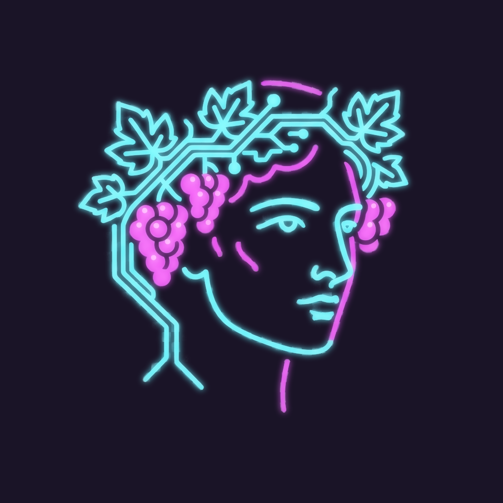
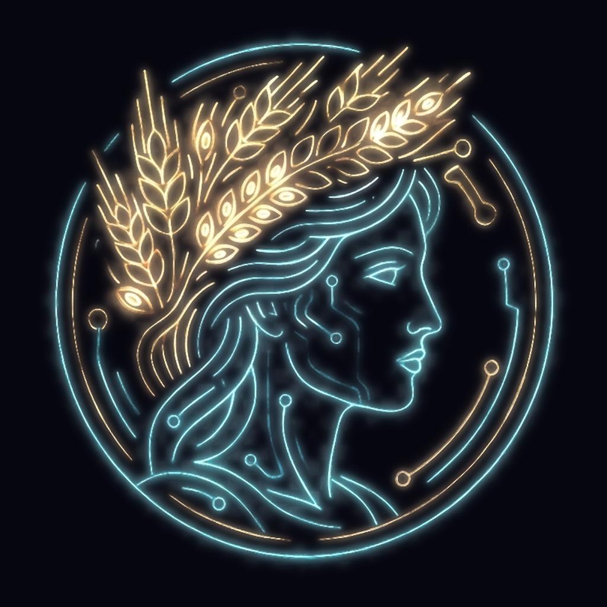
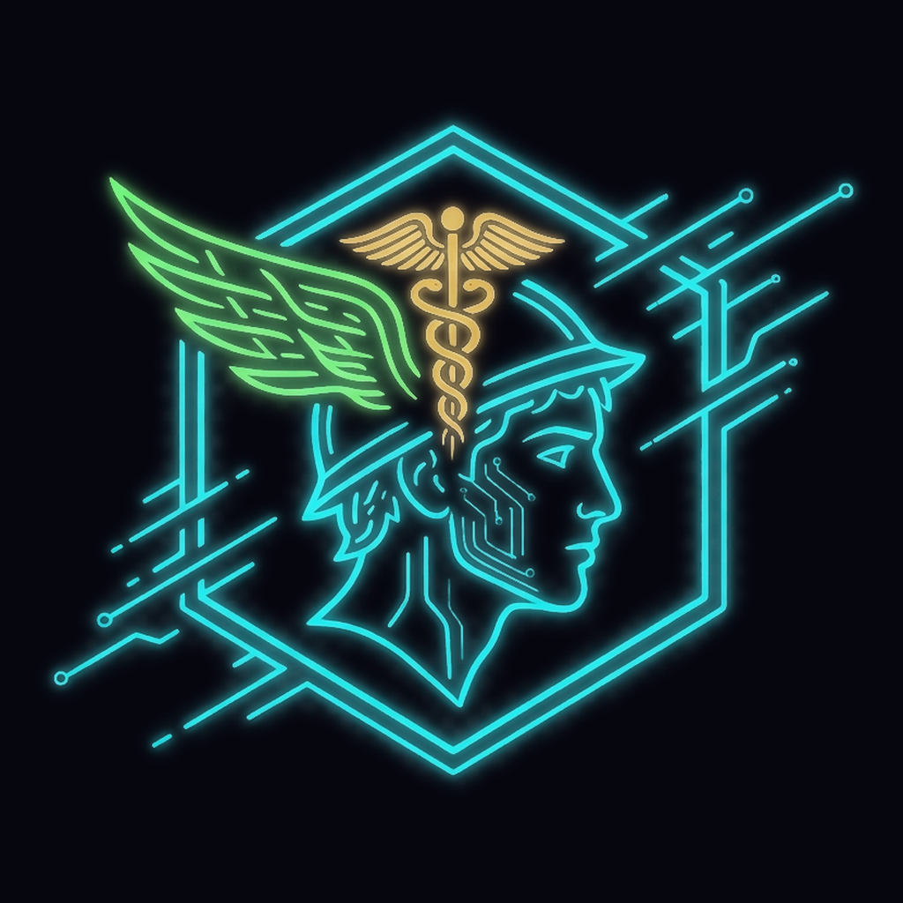
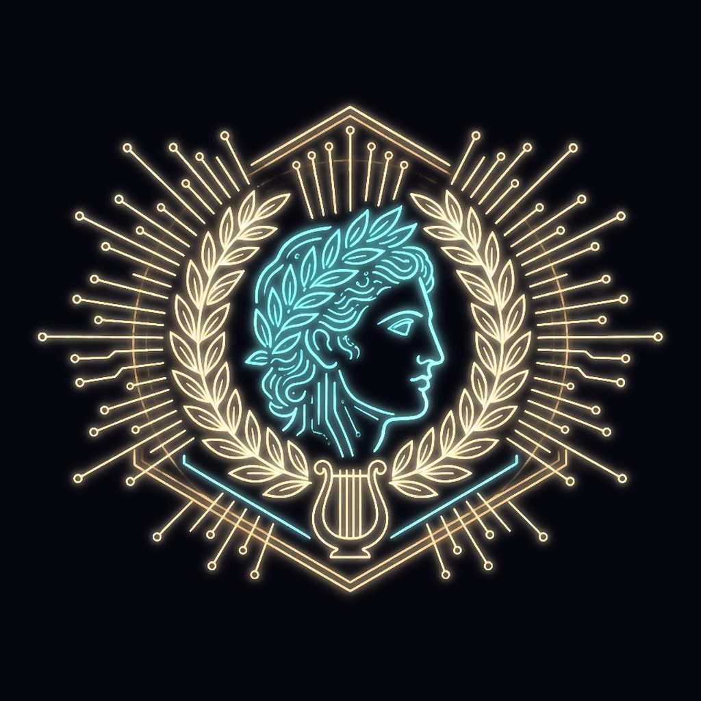
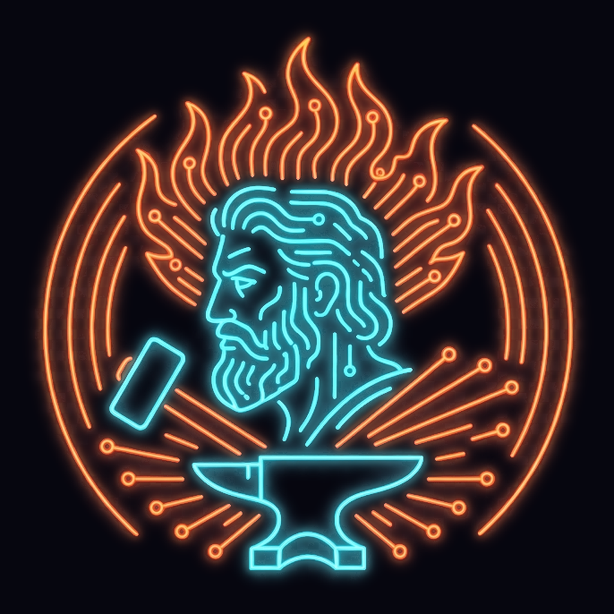
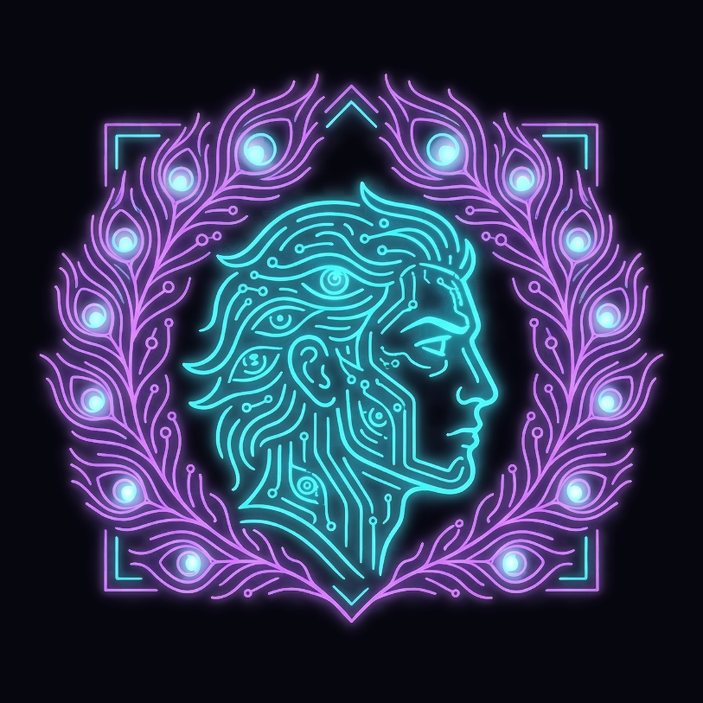
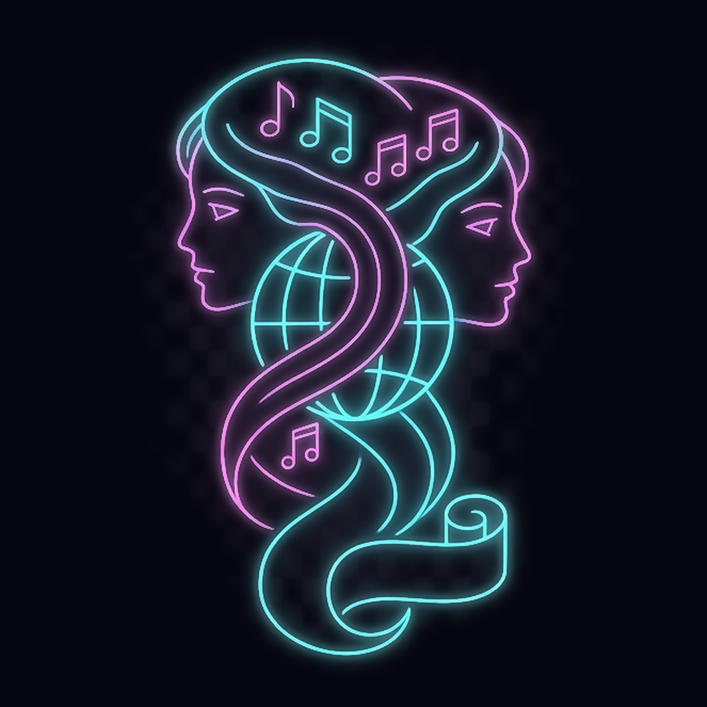
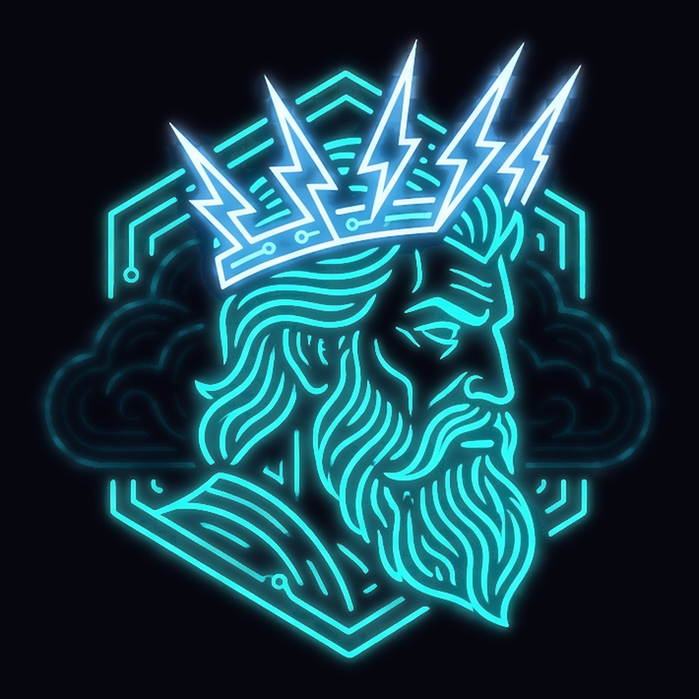
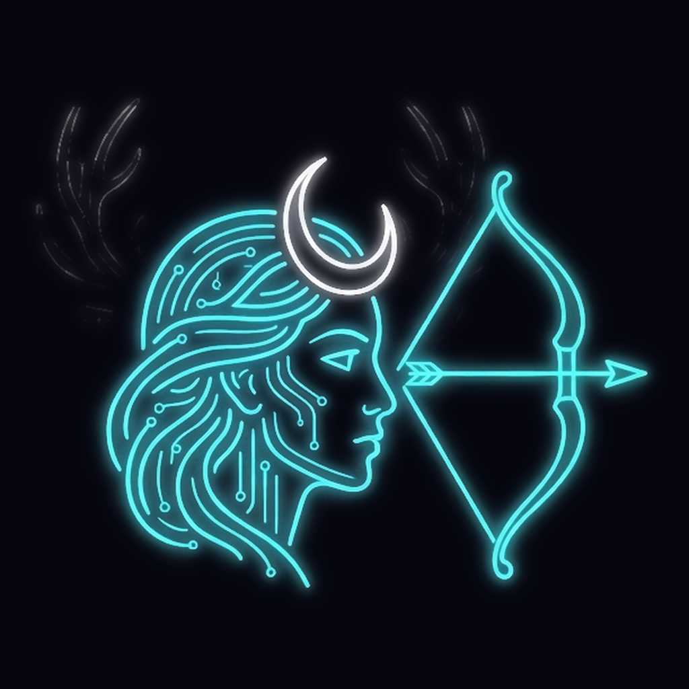

# Brand prompts — the neon god marks

The visual family for the homelab services: cyberpunk neon line-art
portrait of the service's namesake god, cyan (#00F4F6) circuit-linework
base, ONE accent color per god, near-black violet ground (#06060F —
the ui-theme --background), clean minimal vector lines, soft glow,
centered emblem, no text. Accents map to the theme palette so the set
reads as one system.

| Service | God | Accent | Motif |
| --- | --- | --- | --- |
| dionysus | Dionysus | magenta #FF30D3 (--accent) | grape clusters + vine circuit-wreath |
| demeter | Demeter | amber #EDB417 (--status-near) | wheat-sheaf circuit crown |
| hermes | Hermes | green #0AE442 (--status-cookable) | winged helm + caduceus signal lines |
| apollo | Apollo | warm gold-white | laurel sun-ray traces + lyre strings |
| hephaestus | Hephaestus | molten orange-red (--destructive family) | forge-flame traces, hammer + anvil sparks |
| argus | Argus | violet (chart-5) | peacock-feather wreath of glowing sensor eyes |
| muses | The Muses | soft lavender-rose | three overlapping profiles, staff-line and scroll traces |
| zeus | Zeus | white-hot electric blue | lightning-bolt circuit crown, storm-cloud traces |
| artemis | Artemis | silver moonlight | crescent diadem, bow + arrow vector, stag antler traces |
| hera | Hera | imperial rose-gold | regal diadem, peacock-feather scepter, pomegranate node |
| poseidon | Poseidon | deep sapphire | trident, cresting wave traces, sea-foam nodes |
| ares | Ares | blood crimson | Corinthian war helm, crossed spear, shield ring |
| athena | Athena | steel-bronze + olive green | crested helm, perched owl, olive sprig traces |
| aphrodite | Aphrodite | soft coral-pink | rose bloom, scallop shell arc, dove line |
| hestia | Hestia | warm ember gold | round hearth ring, contained flame, rising warmth lines |

## Dionysus (reverse-engineered from the shipped mark)

> Cyberpunk neon line-art logo of Dionysus, Greek god of wine, serene
> male profile in glowing cyan circuit-linework, crowned with an ivy
> and grapevine wreath rendered as circuit traces, grape clusters as
> glowing magenta nodes, dark near-black violet background (#06060F),
> clean minimal vector lines with a soft neon glow, centered emblem,
> no text

## Demeter

> Cyberpunk neon line-art logo of Demeter, Greek goddess of the
> harvest, serene female profile in glowing cyan circuit-linework,
> crowned with a wreath of wheat sheaves and barley rendered as
> golden-amber neon circuit traces, a few glowing grain kernels as
> nodes, dark near-black violet background (#06060F), clean minimal
> vector lines with a soft neon glow, centered emblem, no text

## Hermes

> Cyberpunk neon line-art logo of Hermes, Greek messenger god, sharp
> youthful profile in glowing cyan circuit-linework, winged helm with
> feathers as swept neon-green circuit traces, a small caduceus with
> twin serpents as intertwined signal lines behind the head, sense of
> speed and motion, dark near-black violet background (#06060F), clean
> minimal vector lines with a soft neon glow, centered emblem, no text

## Apollo

> Cyberpunk neon line-art logo of Apollo, Greek god of the sun and
> music, classical male profile in glowing cyan circuit-linework,
> radiant laurel wreath whose leaves become warm golden-white sun-ray
> circuit traces fanning outward, a subtle lyre outline of glowing
> strings at the base, dark near-black violet background (#06060F),
> clean minimal vector lines with a soft neon glow, centered emblem,
> no text

## Hephaestus

> Cyberpunk neon line-art logo of Hephaestus, Greek god of the forge,
> rugged bearded profile in glowing cyan circuit-linework, crowned with
> forge-flame circuit traces in molten orange-red, a hammer over an
> anvil beneath the profile with sparks as glowing ember nodes, dark
> near-black violet background (#06060F), clean minimal vector lines
> with a soft neon glow, centered emblem, no text

## Argus

> Cyberpunk neon line-art logo of Argus Panoptes, the all-seeing
> watchman of Greek myth, vigilant profile in glowing cyan
> circuit-linework, wreathed in peacock feathers rendered as violet
> circuit traces, each feather eye a softly glowing sensor node, a few
> extra watchful eyes woven into the linework, dark near-black violet
> background (#06060F), clean minimal vector lines with a soft neon
> glow, centered emblem, no text

## The Muses

> Cyberpunk neon line-art logo of the Greek Muses, three overlapping
> serene profiles in glowing cyan circuit-linework fading into each
> other, laurel sprigs and a flowing musical staff rendered as soft
> lavender-rose circuit traces winding through their hair, a small
> unrolling scroll of glowing lines at the base, dark near-black violet
> background (#06060F), clean minimal vector lines with a soft neon
> glow, centered emblem, no text

## Zeus

> Cyberpunk neon line-art logo of Zeus, king of the Greek gods, stern
> bearded profile in glowing cyan circuit-linework, crowned with
> jagged lightning-bolt circuit traces in white-hot electric blue,
> storm-cloud contours as layered linework behind the head, one bold
> thunderbolt held vertical beside the profile, dark near-black violet
> background (#06060F), clean minimal vector lines with a soft neon
> glow, centered emblem, no text

## Artemis

> Cyberpunk neon line-art logo of Artemis, Greek goddess of the hunt
> and moon, focused female profile in glowing cyan circuit-linework,
> crescent-moon diadem in cool silver-white neon, a drawn bow and
> nocked arrow as clean vector traces before the profile, faint stag
> antler circuit lines behind, dark near-black violet background
> (#06060F), clean minimal vector lines with a soft neon glow,
> centered emblem, no text

## Hera

> Cyberpunk neon line-art logo of Hera, queen of the Greek gods, regal
> female profile in glowing cyan circuit-linework, tall imperial diadem
> rendered as rose-gold circuit traces, a slender scepter tipped with a
> single peacock-feather eye beside the profile, a small glowing
> pomegranate node at the base, dark near-black violet background
> (#06060F), clean minimal vector lines with a soft neon glow, centered
> emblem, no text

## Poseidon

> Cyberpunk neon line-art logo of Poseidon, Greek god of the sea, strong
> bearded profile in glowing cyan circuit-linework, a bold trident in
> deep sapphire neon rising beside the head, cresting wave contours as
> layered circuit traces around the shoulders, small sea-foam nodes
> along the crests, dark near-black violet background (#06060F), clean
> minimal vector lines with a soft neon glow, centered emblem, no text

## Ares

> Cyberpunk neon line-art logo of Ares, Greek god of war, hard-edged
> profile wearing a crested Corinthian helm in glowing cyan
> circuit-linework, the crest and cheek guards traced in blood-crimson
> neon, a crossed spear behind a circular shield ring of circuit
> segments, dark near-black violet background (#06060F), clean minimal
> vector lines with a soft neon glow, centered emblem, no text

## Athena

> Cyberpunk neon line-art logo of Athena, Greek goddess of wisdom and
> strategy, composed female profile in glowing cyan circuit-linework
> wearing a crested helm traced in steel-bronze neon, a small owl
> perched on the shoulder with round glowing eyes, an olive sprig in
> soft olive-green circuit traces at the base, dark near-black violet
> background (#06060F), clean minimal vector lines with a soft neon
> glow, centered emblem, no text

## Aphrodite

> Cyberpunk neon line-art logo of Aphrodite, Greek goddess of love and
> beauty, graceful female profile in glowing cyan circuit-linework with
> flowing hair, a blooming rose rendered in soft coral-pink circuit
> traces woven into the hair, a scallop-shell arc of fine lines behind
> the head and a single dove outline in flight, dark near-black violet
> background (#06060F), clean minimal vector lines with a soft neon
> glow, centered emblem, no text

## Hestia

> Cyberpunk neon line-art logo of Hestia, Greek goddess of the hearth,
> serene hooded female profile in glowing cyan circuit-linework, a
> perfect round hearth ring below the profile holding a contained flame
> traced in warm ember-gold neon, gentle rising warmth lines as soft
> circuit traces, a feeling of calm and home, dark near-black violet
> background (#06060F), clean minimal vector lines with a soft neon
> glow, centered emblem, no text

Asset pipeline once generated (per the app-logo change): checkerboard-
key the export onto the --background violet, re-synthesize the soft
glow, then cut app/icon.png (favicon), app/apple-icon.png, and
public/logo.png.
